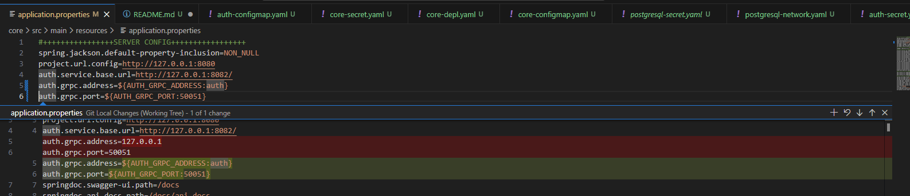

**Changes**


Start Pods 
```bash
kubectl scale deployment activemq-depl --replicas 1 -n mq
kubectl scale deployment auth-depl --replicas 1 -n auth
kubectl scale deployment core-depl --replicas 1 -n core
kubectl scale deployment mysql-depl --replicas 1 -n auth
kubectl scale deployment postgresql-depl --replicas 1 -n core
```

Stop Pods
```bash
kubectl scale deployment activemq-depl --replicas 0 -n mq
kubectl scale deployment auth-depl --replicas 0 -n auth
kubectl scale deployment core-depl --replicas 0 -n core
kubectl scale deployment mysql-depl --replicas 0 -n auth
kubectl scale deployment postgresql-depl --replicas 0 -n core

kubectl delete svc auth-loadbalancer -n auth
kubectl delete svc mysql-loadbalancer -n auth
kubectl delete svc core-loadbalancer -n core
kubectl delete svc postgresql-loadbalancer -n core
kubectl delete svc activemq-loadbalancer -n mq
```

Node Labels 
```bash
kubectl label node desktop-worker workload=auth
kubectl label node desktop-worker2 workload=core
kubectl label node desktop-control-plane workload=mq

kubectl get nodes --show-labels
kubectl get pods -A -o wide
```

Test
```bash
kubectl exec -it postgresql-depl-854548894d-zsjlf -n core -- psql -U postgres -d core

# Core Microservice
kubectl exec -it core-depl-db46fcff8-m72kn -n core -- nc -zv postgresql-clusterip-srv.core.svc.cluster.local 5432
kubectl exec -it core-depl-db46fcff8-m72kn -n core -- nc -zv mysql-clusterip-srv.auth.svc.cluster.local 3306
kubectl exec -it core-depl-db46fcff8-m72kn -n core -- nc -zv activemq-clusterip-srv.mq.svc.cluster.local 61616
kubectl exec -it core-depl-db46fcff8-m72kn -n core -- nc -zv auth-clusterip-srv.auth.svc.cluster.local 8082
kubectl exec -it core-depl-db46fcff8-m72kn -n core -- nc -zv auth-clusterip-srv.auth.svc.cluster.local 50051

# Auth Microservice
kubectl exec -it auth-depl-6d8f4f645-9ggk2 -n auth -- nc -zv postgresql-clusterip-srv.core.svc.cluster.local 5432
kubectl exec -it auth-depl-6d8f4f645-9ggk2 -n auth -- nc -zv mysql-clusterip-srv.auth.svc.cluster.local 3306
kubectl exec -it auth-depl-6d8f4f645-9ggk2 -n auth -- nc -zv activemq-clusterip-srv.mq.svc.cluster.local 61616
kubectl exec -it auth-depl-6d8f4f645-9ggk2 -n auth -- nc -zv core-clusterip-srv.core.svc.cluster.local 8080

# Users Microservice
kubectl exec -it users-depl-6886ff94bf-6ljll -n auth -- nc -zv postgresql-clusterip-srv.core.svc.cluster.local 5432
kubectl exec -it users-depl-6886ff94bf-6ljll -n auth -- nc -zv mysql-clusterip-srv.auth.svc.cluster.local 3306
kubectl exec -it users-depl-6886ff94bf-6ljll -n auth -- nc -zv activemq-clusterip-srv.mq.svc.cluster.local 61616
kubectl exec -it users-depl-6886ff94bf-6ljll -n auth -- nc -zv core-clusterip-srv.core.svc.cluster.local 8080
kubectl exec -it users-depl-6886ff94bf-6ljll -n auth -- nc -zv auth-clusterip-srv.auth.svc.cluster.local 8082
kubectl exec -it users-depl-6886ff94bf-6ljll -n auth -- nc -zv auth-clusterip-srv.auth.svc.cluster.local 50051
``` 